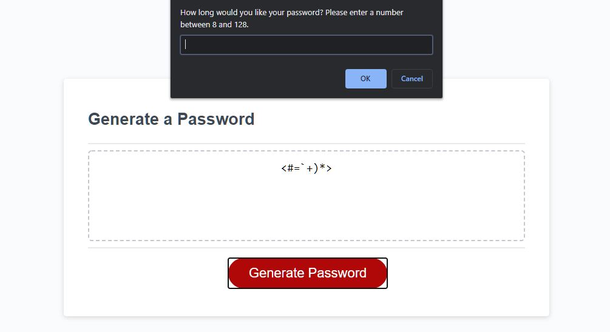
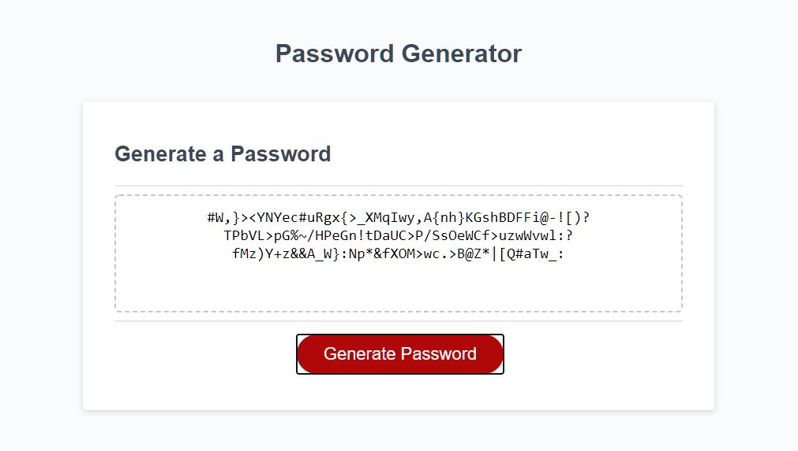

# Password Generator

## Table of Contents
* [Description](#description)
* [The Challenge](#challenge)
* [The Criteria](#criteria)
* [Final Result](#results)
* [Reflection](#reflection)

## Description 
This password generator was created as the third assigment for my coding Bootcamp and was the first project involving JavaScript.

 

## The Challenge 
Create an interactive password generator to create secure passwords based on user input.

## The Criteria 
1. When "generate password" button is clicked, the user is presented with a series of prompts for password criteria to select
1. User chooses to have at least 8 and no more than 128 characters
1. User can choose between having lowercase, uppercase, numeric, and/or special characters
1. The user input is validated to make sure they selected at least one of the above criteria
1. Once the criteria is met, a randomly generated password is display on screen

## Final Result 
The final generator can be viewed at [https://ianjacksondesign.com/password-generator/](https://ianjacksondesign.com/password-generator/)

## Reflection 
This was the hardest project yet. I already had HTML and CSS knowledge coming in to this Bootcamp so the first couple of lessons were pretty familiar. I had studied JavaScript in the past as well and have what I consider the most basic of understandings of it, but have always struggled with it. This was no different. 

I started out by writing out psuedocode to break down what I wanted the script to do. Once I already started rewritting my code though, I think I restarted a minimum of 3 times trying to figure out how to get everything to work. 

I found myself getting really hung up on the fact that I knew the code I was writing wasn't the best code and that while it was working and doing what I wanted it to do, it was just extremely long and clunky. Even searching around and looking at stackoverflow and other forums and seeing people doing similar projects, I was seeing a lot of objects and functions that I couldn't quite wrap my head around. 

In the end I have a working generator that hits all the required assignment criteria, and while I know the code could be better, I'm still proud I was able to write it myself. 